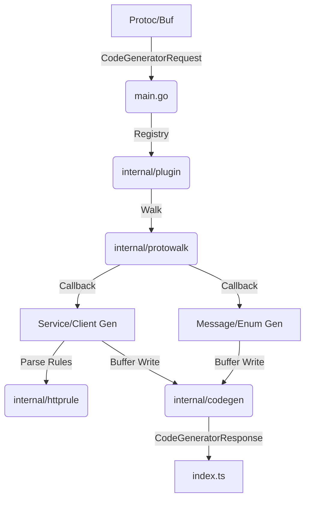

# protoc-gen-typescript-http 项目深度分析报告

## 1. 项目概述
- **主要功能与目的**：该项目是一个 `protoc` 插件（及 `buf` 插件），专门用于解析带有 `google.api.http` 注解的 Protobuf 定义，并生成对应的 TypeScript 类型定义和类型安全的 HTTP 客户端。它特别针对 [go-kratos](https://github.com/go-kratos/kratos) 生态设计，旨在简化前端/客户端与后端 RESTful API 的交互。
- **技术栈**：
  - **核心语言**：Go (版本 1.25.7+)
  - **依赖库**：`google.golang.org/protobuf`（官方 Go Protobuf 库）、`google.golang.org/genproto/googleapis/api`（Google API 注解定义）
  - **构建与任务管理**：Mage、Makefile、Buf
  - **生成目标**：TypeScript
- **许可证类型**：MIT 许可证 (Einride AB)
- **项目活跃度**：活跃。项目由 `go-kratos` 维护，最近有持续更新，虽然贡献者人数较少（核心约 3 人），但代码质量和文档非常规范。

## 2. 代码结构分析
### 2.1 目录结构
```text
.
├── main.go                # 插件入口
├── internal/
│   ├── codegen/           # 代码生成辅助工具（Buffer 写入等）
│   ├── httprule/          # 核心：google.api.http 路径模板解析器
│   ├── plugin/            # 核心：TypeScript 生成逻辑（Message/Enum/Service）
│   └── protowalk/         # 核心：Protobuf 描述符树递归遍历器
├── docs/                  # 详尽的架构与功能文档
├── examples/              # 集成测试用的示例 proto 及生成的 TS 代码
└── tests/                 # 集成测试脚本
```

### 2.2 关键代码模块
- **`main.go`**：负责标准的插件协议处理（从 stdin 读取 `CodeGeneratorRequest`，向 stdout 写入 `CodeGeneratorResponse`）。
- **`internal/plugin/generate.go`**：生成流程的编排者，负责按 package 分组并调用具体的生成器。
- **`internal/httprule/template.go`**：解析 URI 模板（如 `/v1/{name=shippers/*}`），将其转化为结构化的段（Literal, Variable, Wildcard）。
- **`internal/plugin/servicegen.go`**：生成 TypeScript Service 接口和具体的客户端实现逻辑，包括 URL 拼接、Body 序列化和查询参数处理。
- **`internal/plugin/type.go`**：定义 Protobuf 到 TypeScript 的类型映射矩阵。

### 2.3 设计模式与架构
- **访问者模式 (Visitor-like)**：通过 `protowalk` 模块递归遍历 Protobuf 描述符，并在回调中分发给具体的生成逻辑，有效地处理了嵌套 Message 和循环引用。
- **抽象传输层 (RequestHandler)**：生成的客户端并不绑定具体的 HTTP 库（如 Axios 或 Fetch），而是要求用户提供一个 `RequestHandler`。这种“插件式”设计使生成的代码具有极强的环境适应性。

## 3. 功能地图
### 3.1 核心功能列表
1.  **类型同步**：自动将 Protobuf Message 转为 TypeScript `type` 别名，遵循 JSON 命名规范（camelCase）。
2.  **枚举支持**：转为 TypeScript 字符串联合类型。
3.  **智能路由生成**：
    - 自动从路径变量中提取字段。
    - 自动验证路径必填字段。
    - 自动根据 `body` 选项决定序列化策略。
4.  **查询参数自动映射**：将未被路径和 Body 覆盖的字段自动转为 URL Query Parameters。
5.  **Well-Known Types (WKT)**：对 `Timestamp`、`Duration`、`Struct` 等 Google 标准类型提供符合 TS 习惯的特殊映射。

### 3.2 功能交互流程


## 4. 依赖关系分析
- **外部依赖**：
  - `google.golang.org/protobuf`：核心驱动。
  - `gotest.tools/v3`：用于测试断言。
- **内部依赖**：`plugin` 模块高度依赖 `httprule`（解析路由）和 `codegen`（输出格式化）。
- **依赖风险评估**：极低。项目主要依赖官方库，且不带任何运行时依赖到生成的 TypeScript 中。

## 5. 代码质量评估
- **可读性**：极高。遵循 Go 惯用法，变量命名清晰。
- **文档完整性**：非常出色。`docs/` 目录下涵盖了从架构、解析规则到开发指南的所有内容，这在开源插件中属于上乘水平。
- **测试覆盖率**：
  - `httprule`（解析逻辑）有完善的单元测试。
  - 采用**黄金文件测试 (Golden File Testing)**：通过 `examples/` 中的代码生成结果进行集成验证，确保任何改动都不会引起非预期的代码变更。
- **改进空间**：
  - **64 位整数精度**：目前将 `int64` 映射为 `number`，在 JS 中存在精度丢失风险（规范建议用 `string`）。
  - **oneof 支持**：目前 oneof 字段被展平为独立可选字段，未在 TS 类型层面实现“互斥”约束。

## 6. 关键算法和数据结构
- **URI 模板解析算法**：在 `internal/httprule` 中实现了一个微型解析器，用于处理带变量绑定和通配符的复杂路径模式。
- **JSON 路径提取 (jsonleafwalk)**：递归遍历 Message 结构，查找所有可以映射到查询参数的“叶子”字段。使用 `map` 进行祖先记录，以防止无限循环引用。

## 7. 函数调用图 (核心路径)
1.  `main.run()`: 插件启动。
2.  `plugin.Generate()`: 初始化注册表。
3.  `packageGenerator.Generate()`: 循环处理每个包。
4.  `protowalk.WalkFiles()`: 深度优先遍历描述符。
5.  `serviceGenerator.generateMethod()`: 生成客户端方法的代码块：
    - `generateMethodPathValidation()`: 生成变量非空检查。
    - `generateMethodPath()`: 生成 Template Literal 路径。
    - `generateMethodBody()`: 处理 JSON 序列化。
    - `generateMethodQuery()`: 收集剩余字段到数组。

## 8. 安全性分析
- **输入过滤**：生成的客户端对所有路径变量和查询参数使用 `encodeURIComponent`，有效防止了简单的 URL 注入攻击。
- **验证机制**：生成的代码在客户端预先校验路径变量的完整性，避免发送无效请求到后端。

## 9. 可扩展性与性能
- **可扩展性**：通过 `wellknown.go` 可以很方便地添加对自定义 WKT 的支持。
- **性能**：由于是在编译期生成代码，生成的代码是高度优化的字符串拼接和简单的逻辑判断，运行时性能开销极低。插件自身的 Go 实现利用了 Protobuf 的反射机制，对于大规模 Proto 定义文件也能快速处理。

## 10. 总结与建议
### 整体评价
这是一个**工业级**的 Protobuf 插件，设计严谨，特别是在解决 REST 到 RPC 映射的复杂性（如路径变量与查询参数的分离）上做得非常出色。

### 主要优势
- **生成的代码零依赖**：不需要引入任何运行时库。
- **契约先行 (Contract-First)**：强制前后端遵循同一种类型契约。
- **极佳的 DX（开发者体验）**：详尽的注释和类型安全。

### 建议
1.  **修复 64 位整数问题**：考虑提供一个选项，允许将 `int64`/`uint64` 映射为 `string`。
2.  **增强 oneof 映射**：利用 TypeScript 的辨析联合类型（Discriminated Unions）来增强 oneof 的类型安全性。
3.  **支持 additional_bindings**：目前只处理主 HTTP 绑定，忽略了 `additional_bindings`，这在处理遗留 API 适配时会有局限。
