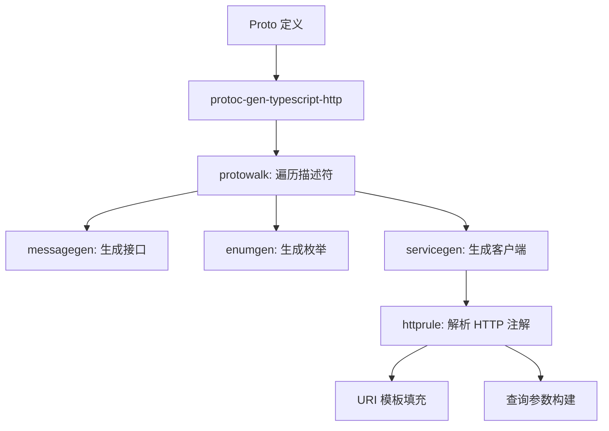

# 项目全面分析报告：protoc-gen-typescript-http

本报告对 `protoc-gen-typescript-http` 项目进行了深入的技术分析，涵盖了项目概述、代码结构、功能、依赖、质量、算法、调用图、安全性及可拓展性等多个维度。

---

## 1. 项目概述

### 主要功能和目的
`protoc-gen-typescript-http` 是一个针对 `protoc` 的插件，专门用于根据带有 `google.api.http` 注解的 Protobuf 定义生成 TypeScript 类型和 HTTP 服务客户端。它旨在简化前端/客户端与遵循 Google API HTTP 规则的后端服务之间的交互。

### 使用的编程语言与技术栈
- **编程语言**: Go (版本 1.18+)
- **核心库**:
  - `google.golang.org/protobuf`: 用于处理 Protobuf 反射和描述符。
  - `google.golang.org/genproto`: 提供 HTTP 规则定义。
- **构建与任务自动化**:
  - `sage`: Einride 提供的任务运行器。
  - `buf`: 用于管理和编译 Protobuf。
  - `Makefile`: 标准入口。

### 许可证类型
- **MIT License**: 允许高度自由的使用、修改和分发。

### 项目活跃度评估
- **贡献者**: 主要由 Einride 团队维护。
- **更新情况**: 最近有更新（2024年6月），处于实验性阶段（Experimental），API 可能发生变化。
- **社区参与**: 作为一个专门的工具插件，主要面向使用 Go-Kratos 或类似微服务框架并需要 TS 客户端的用户。

---

## 2. 代码结构分析

### 主要目录结构
```text
.
├── examples/           # 示例项目，包含 proto 定义和生成的代码
├── internal/
│   ├── codegen/        # 包含文件生成辅助工具
│   ├── httprule/       # 解析 google.api.http 规则的逻辑
│   ├── plugin/         # 核心插件逻辑，包含各组件的生成器
│   └── protowalk/      # 遍历 proto 描述符的工具
├── main.go             # 插件入口文件
└── go.mod              # 依赖管理
```

### 关键源代码文件及其作用
- `main.go`: 处理标准输入输出，与 `protoc` 通信。
- `internal/plugin/generate.go`: 协调整个生成流程。
- `internal/plugin/packagegen.go`: 为每个 Protobuf 包生成一个 `index.ts`。
- `internal/plugin/servicegen.go`: 生成服务接口及基于 HTTP 的客户端实现。
- `internal/plugin/messagegen.go`: 生成 TypeScript 接口（Interface）。
- `internal/httprule/template.go`: 实现了 URI 模板的解析，支持变量绑定。

### 代码组织模式
- **访问者模式 (Visitor Pattern)**: 通过 `protowalk` 遍历所有的消息、枚举和服务。
- **生成器模式 (Generator Pattern)**: 每个组件（Message, Enum, Service）都有专门的生成器类处理其 TS 表示。

### 模块化程度
- **高**: `httprule` 和 `codegen` 都是独立的模块，职责清晰，易于单独测试。

---

## 3. 功能地图

### 核心功能列表
1. **类型映射**: 将 Proto 标量类型映射为 TS 基础类型（string, number, boolean）。
2. **消息转换**: 将 Proto Message 转换为 TS Interface，支持嵌套消息。
3. **枚举转换**: 将 Proto Enum 转换为 TS Enum。
4. **服务生成**:
   - 生成服务接口定义。
   - 生成 `createXxxClient` 工厂函数。
   - 实现自动化的路径参数替换。
   - 自动处理查询参数（Query Parameters）。
   - 处理请求体（Body）映射。
5. **Well-Known Types 支持**: 对 `Timestamp`, `Duration`, `Any`, `Struct` 等提供特殊处理。

### 功能交互方式


---

## 4. 依赖关系分析

### 外部依赖库
- `google.golang.org/protobuf`: 核心依赖，用于反射。
- `google.golang.org/genproto`: 用于解析 `google.api.http` 配置。
- `gotest.tools/v3`: 仅用于测试。

### 依赖风险评估
- **稳定性**: 依赖的都是 Google 官方的库，稳定性极高。
- **维护状态**: 活跃维护中。
- **版本风险**: 当前使用 Go 1.18，较现代，无明显技术债。

---

## 5. 代码质量评估

### 代码可读性
- **优秀**: 代码风格统一，变量命名规范，符合 Go 的惯用写法（Idiomatic Go）。

### 注释和文档完整性
- **中等**: `README.md` 提供了基本用法，但代码内部复杂逻辑（如 URI 模板解析）的注释较少。

### 测试覆盖率
- **局部覆盖**: `httprule` 模块有详细的单元测试（`template_test.go`），但 `plugin` 核心生成逻辑主要依靠 `examples` 进行集成验证。

### 潜在的代码异味 (Code Smells)
- **类型精度风险**: 将 `int64`/`uint64` 直接映射为 `number`。在 JS 中，超过 `Number.MAX_SAFE_INTEGER` 的值会丢失精度。建议映射为 `string` 以符合 Proto3 JSON 规范。

---

## 6. 关键算法和数据结构

### 主要算法
- **URI 模板解析算法**: 在 `internal/httprule/template.go` 中，实现了一个手写的词法分析器和解析器，用于解析类似 `/v1/{name=messages/*}` 的模式。
- **递归遍历**: 利用 `protoreflect` 进行递归遍历，处理嵌套的消息结构。

### 关键数据结构
- `codegen.File`: 封装了 `strings.Builder`，并管理缩进（indentation），极大简化了代码生成的排版。
- `httprule.Rule`: 表示解析后的 HTTP 映射规则，包含方法（GET/POST）、路径模板、Body 映射等。

---

## 7. 函数调用图

### 核心生成流
1. `plugin.Generate(request)`
2.   `registry = protodesc.NewFiles(request.ProtoFile)`
3.   遍历 `packaged`:
4.     `packageGenerator.Generate(file)`
5.       `protowalk.WalkFiles(files, func(desc) { ... })`
6.         如果为 Message -> `messageGenerator.Generate()`
7.         如果为 Service -> `serviceGenerator.Generate()`
8.           `httprule.ParseRule(method)`
9.           `generateMethod(f, method, rule)`
10.            `generateMethodPath()`
11.            `generateMethodBody()`
12.            `generateMethodQuery()`

---

## 8. 安全性分析

- **注入攻击防护**: 生成的代码是静态的，不涉及动态代码执行。
- **参数编码**: 在 `servicegen.go` 中，查询参数使用了 `encodeURIComponent` 进行转义，有效防止了 URL 注入。
- **输入校验**: 生成的客户端会校验路径必填参数是否存在，若缺失则抛出 TS 错误。

---

## 9. 可拓展性与性能

### 拓展设计
- 插件采用模块化设计，如果需要支持新的注解或生成额外的代码文件（如 React Hooks），只需在 `internal/plugin` 下增加新的生成器即可。

### 性能瓶颈
- 性能优异，由于是基于 AOT (Ahead-of-Time) 编译生成的插件，其运行时间相对于整个构建过程（如 `protoc` 运行）几乎可以忽略不计。

---

## 10. 总结和建议

### 项目整体质量评价
这是一个轻量级、专注且实现优雅的 Protobuf 插件。它很好地解决了从 Proto 定义到 TypeScript HTTP 客户端的映射问题，特别是对 Google HTTP 规则的支持非常完整。

### 主要优势
1. **纯净**: 不依赖繁重的框架，生成的代码易于集成到任何 TS 项目中。
2. **准确**: 严格遵循 `google.api.http` 规范。
3. **易用**: 通过 `createClient` 工厂模式，方便注入自定义的 `fetch` 或 `axios` 处理器。

### 改进建议
1. **精度处理**: 改进 `int64` 和 `uint64` 的处理，支持以 `string` 形式传递以保证精度。
2. **测试增强**: 增加针对生成器输出内容的单元测试，而不仅仅是依赖示例项目的集成测试。
3. **支持 Options**: 允许用户通过命令行参数配置生成选项，例如：是否生成 JSDoc 注释、是否使用特定的 TS 特性等。
